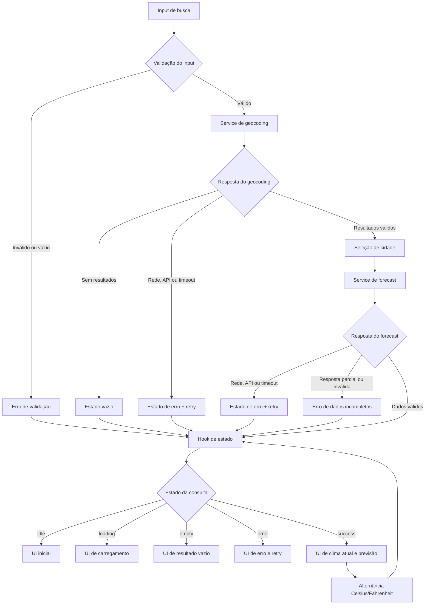

# Weather App — Plano Técnico

## Architecture

Construir uma SPA React/Vite em camadas, com estado local mínimo:

- `components/`: apresentação e interação acessível.
- `hooks/`: orquestração do fluxo de busca, seleção e previsão.
- `services/`: clientes HTTP e validação das respostas externas.
- `utils/`: funções puras de validação, conversão, datas e códigos WMO.
- `types/`: contratos compartilhados internos e DTOs externos.

`App` compõe a tela e `useWeatherSearch` coordena o fluxo. Componentes não chamam `fetch` diretamente. O estado da busca de cidade deve ser separado do estado da previsão, pois cada operação possui loading, empty, error e retry próprios.

Usar `fetch` nativo com `AbortController`; não adicionar React Query, Redux ou outra biblioteca de estado no MVP.

## Tech Stack

- TypeScript strict, React 19 e React DOM.
- Vite para desenvolvimento e build.
- Tailwind CSS para estilo responsivo conforme o tema existente.
- `fetch` nativo para a Open-Meteo, sem API key e sem backend intermediário.
- Vitest, Testing Library e `@testing-library/user-event` para testes unitários e de componentes.
- Playwright para testes E2E em Chromium e viewport mobile.
- Biome para lint e formatação.

Não instalar bibliotecas adicionais de estado, HTTP, ícones ou validação sem necessidade comprovada. Não incluir autenticação, favoritos, histórico, PWA, offline ou provedor alternativo no MVP.

## Project Structure

- `src/main.tsx`: entrada React.
- `src/App.tsx`: composição da aplicação.
- `src/index.css`: Tailwind e estilos globais mínimos.
- `src/components/SearchForm.tsx`: input, validação, envio e loading.
- `src/components/LocationResults.tsx`: lista acessível e seleção de cidade.
- `src/components/CurrentWeather.tsx`: localização, temperatura e dados atuais.
- `src/components/ForecastList.tsx`: cinco períodos diários.
- `src/components/TemperatureUnitToggle.tsx`: controle Celsius/Fahrenheit.
- `src/components/QueryStatus.tsx`: loading, vazio e erro com retry.
- `src/hooks/useWeatherSearch.ts`: fluxo e coordenação das requisições.
- `src/services/openMeteoClient.ts`: URLs, parâmetros, timeout e HTTP.
- `src/services/weatherParser.ts`: validação e transformação dos DTOs.
- `src/types/weather.ts`: modelos internos e estados.
- `src/types/openMeteo.ts`: respostas mínimas da API.
- `src/utils/input.ts`: normalização e validação da busca.
- `src/utils/temperature.ts`: conversão e arredondamento.
- `src/utils/weatherCodes.ts`: tabela WMO em pt-BR.
- `src/utils/date.ts`: datas e timezone.
- `tests/unit/`: funções puras, parsers, serviço e hooks.
- `tests/components/`: estados e interações dos componentes.
- `tests/e2e/weather-app.spec.ts`: fluxo principal e falhas com rede interceptada.

## Data Model

Contratos internos recomendados:

```typescript
type TemperatureUnit = 'celsius' | 'fahrenheit'
type QueryStatus = 'idle' | 'loading' | 'success' | 'empty' | 'error'

interface Location {
  id: number
  name: string
  country: string
  state?: string
  latitude: number
  longitude: number
  timezone?: string
}

interface CurrentWeather {
  temperature: number
  weatherCode: number
  conditionLabel: string
  observedAt: string
  humidity?: number
  precipitation?: number
  windSpeedKmh?: number
}

interface DailyForecast {
  date: string
  weatherCode: number
  conditionLabel: string
  temperatureMin: number
  temperatureMax: number
}

interface WeatherResult {
  location: Location
  current: CurrentWeather
  forecast: DailyForecast[]
  timezone: string
  unit: TemperatureUnit
}

interface AsyncState<T> {
  status: QueryStatus
  data?: T
  error?: AppError
}

interface AppError {
  code: 'validation' | 'empty' | 'timeout' | 'network' | 'http' | 'invalid-response'
  message: string
  retryable: boolean
}
```

DTOs externos devem conter somente os campos consumidos. O parser deve rejeitar localização ou coordenadas inválidas, temperatura atual ausente, código climático ausente, timezone ausente ou previsão diferente de cinco datas únicas e consecutivas com mínima e máxima presentes. Dados complementares são opcionais.

## Data Flow

1. O usuário digita a cidade; o formulário normaliza espaços e valida entre 1 e 100 caracteres.
2. `useWeatherSearch` inicia geocoding com identificador de requisição e `AbortController`; o status vira `loading`.
3. O cliente converte HTTP/JSON em DTO ou erro tipado. Resposta vazia vira `empty`; resultados válidos viram `Location[]`.
4. Com múltiplos locais, o usuário seleciona uma opção. Com um local, a seleção pode ser automática.
5. A seleção dispara uma consulta de previsão usando coordenadas, `timezone=auto` e a unidade atual.
6. O parser valida o contrato, converte códigos WMO em textos pt-BR e produz `WeatherResult`.
7. A UI renderiza clima atual e exatamente cinco dias. A troca de unidade recalcula os valores sem nova consulta no MVP.
8. Nova busca invalida a requisição anterior; respostas antigas não podem atualizar a tela.



## External APIs

### Open-Meteo Geocoding

- **URL:** `https://geocoding-api.open-meteo.com/v1/search`.
- **Método:** `GET`.
- **Parâmetros:**
  - `name`: termo normalizado informado pelo usuário.
  - `count=10`: limite de resultados apresentados.
  - `language=pt`: nomes localizados quando disponíveis.
  - `format=json`: formato da resposta.
- **Exemplo resumido:**

```json
{
  "results": [
    {
      "id": 3448439,
      "name": "São Paulo",
      "latitude": -23.5475,
      "longitude": -46.63611,
      "country_code": "BR",
      "country": "Brasil",
      "admin1": "São Paulo",
      "timezone": "America/Sao_Paulo"
    }
  ]
}
```

- **Mapeamento para `Location`:** `id` → `id`; `name` → `name`; `country` → `country`; `admin1` → `state`; `latitude` → `latitude`; `longitude` → `longitude`; `timezone` → `timezone`. `country_code` pode ser descartado se não fizer parte do contrato interno.
- **Validação:** cada resultado utilizável deve ter `id`, `name`, `latitude` e `longitude` válidos. `country`, `admin1` e `timezone` podem ser opcionais conforme a resposta. Lista ausente ou vazia representa `empty`, não erro de aplicação.

### Open-Meteo Forecast

- **URL:** `https://api.open-meteo.com/v1/forecast`.
- **Método:** `GET`.
- **Parâmetros:**
  - `latitude` e `longitude`: coordenadas do `Location` escolhido.
  - `current=temperature_2m,relative_humidity_2m,precipitation,wind_speed_10m,weather_code`: dados atuais necessários e complementares.
  - `daily=weather_code,temperature_2m_min,temperature_2m_max`: condição e temperaturas diárias.
  - `forecast_days=5`: hoje mais quatro dias.
  - `timezone=auto`: datas e horários no fuso das coordenadas.
  - `temperature_unit=celsius|fahrenheit`: unidade solicitada; o padrão da aplicação é `celsius`.
  - `wind_speed_unit=kmh`: velocidade do vento em km/h.
- **Exemplo resumido:**

```json
{
  "timezone": "America/Sao_Paulo",
  "current": {
    "time": "2026-09-16T10:00",
    "temperature_2m": 22.4,
    "relative_humidity_2m": 68,
    "precipitation": 0.2,
    "wind_speed_10m": 12.5,
    "weather_code": 2
  },
  "daily": {
    "time": ["2026-09-16", "2026-09-17", "2026-09-18", "2026-09-19", "2026-09-20"],
    "weather_code": [2, 61, 3, 1, 0],
    "temperature_2m_min": [18.1, 17.4, 16.8, 17.2, 18.0],
    "temperature_2m_max": [25.3, 23.0, 24.1, 26.0, 27.2]
  }
}
```

- **Mapeamento para `CurrentWeather`:** `current.time` → `observedAt`; `current.temperature_2m` → `temperature`; `current.weather_code` → `weatherCode` e `conditionLabel` via tabela WMO; `current.relative_humidity_2m` → `humidity`; `current.precipitation` → `precipitation`; `current.wind_speed_10m` → `windSpeedKmh`.
- **Mapeamento para `DailyForecast[]`:** combinar os arrays por índice: `daily.time[i]` → `date`; `daily.weather_code[i]` → `weatherCode` e `conditionLabel`; `daily.temperature_2m_min[i]` → `temperatureMin`; `daily.temperature_2m_max[i]` → `temperatureMax`.
- **Mapeamento para `WeatherResult`:** reutilizar o `Location` selecionado em `location`; `timezone` → `timezone`; unidade solicitada → `unit`; objetos transformados → `current` e `forecast`.
- **Validação:** o sucesso exige `timezone`, campos atuais essenciais e cinco datas únicas e consecutivas com código WMO, mínima e máxima numéricos em cada posição. Dados complementares ausentes podem ser omitidos ou marcados como indisponíveis. O cliente deve validar status HTTP, JSON e campos antes de expor dados à UI.

## State Management

O estado deve viver em `useWeatherSearch`, usando `useState` e `useRef`, sem Context global no MVP. Componentes recebem dados e callbacks por props e não acessam APIs diretamente.

Estado mínimo:

- `query: string`.
- `selectedLocation?: Location`.
- `unit: TemperatureUnit`, inicial `celsius`.
- `locations: AsyncState<Location[]>`.
- `weather: AsyncState<WeatherResult>`.
- `requestId` e/ou `AbortController` para concorrência.

`QueryStatus` controla a renderização de `idle`, `loading`, `success`, `empty` e `error`.

- `idle`: nenhuma consulta iniciada; formulário disponível.
- `loading`: requisição em andamento; indicador acessível e envio duplicado bloqueado.
- `success`: dados válidos disponíveis para renderização.
- `empty`: geocoding sem resultados; nova busca disponível.
- `error`: falha recuperável ou resposta inválida; contexto preservado e retry disponível.

A busca de cidades e a consulta meteorológica devem manter estados independentes. Retry reutiliza a query normalizada para geocoding ou a localização selecionada para forecast. Uma nova busca invalida a requisição anterior e respostas obsoletas não podem alterar a tela.

A unidade é derivada na renderização, sem novo request. Os dados podem ser mantidos em Celsius e convertidos para Fahrenheit somente quando `unit` for `fahrenheit`:

```ts
const displayedTemperature = unit === 'fahrenheit'
  ? Math.round(celsius * 9 / 5 + 32)
  : Math.round(celsius)
```

## Error Handling

1. Input vazio, inválido ou acima de 100 caracteres: erro de validação, sem chamada HTTP e foco no campo.
2. Geocoding sem resultados: estado vazio em pt-BR, com nova busca disponível.
3. HTTP não-2xx, JSON malformado ou schema inválido: erro `http` ou `invalid-response`, sem renderizar sucesso e com retry.
4. Falha de rede: erro `network`, contexto preservado e retry manual.
5. Timeout: abortar após 10 segundos, exibir mensagem específica e permitir retry manual; sem retry automático.
6. Resposta meteorológica parcial: rejeitar como sucesso se faltar campo essencial ou algum dos cinco períodos; dados complementares ausentes devem ser omitidos ou marcados como indisponíveis.
7. Concorrência: abortar ou invalidar a requisição anterior e ignorar respostas obsoletas.
8. Mensagens de erro devem estar em pt-BR, possuir status acessível e não expor detalhes técnicos sensíveis.

## Testing Strategy

### Testes unitários

Com Vitest, cobrir:

- normalização e validação de entrada, incluindo Unicode, espaços e limite de 100 caracteres;
- conversões Celsius/Fahrenheit, arredondamento e valores negativos ou decimais;
- tabela WMO e fallback para código desconhecido;
- cálculo e formatação de datas no timezone da localização;
- parsers de geocoding e forecast, incluindo campos ausentes, duplicados, menos de cinco dias e JSON inválido;
- timeout, erros HTTP e mapeamento para `AppError`.

Os services devem usar `fetch` mockado e nunca chamar a Open-Meteo real. Verificar também URL, query parameters, quantidade de chamadas e ausência de chamada para input inválido.

### Testes de componentes

Com Testing Library, cobrir:

- envio por botão e teclado;
- foco e mensagem de validação;
- lista ambígua e seleção de localização;
- estados loading, empty, error e success;
- retry preservando contexto;
- toggle de unidade e atualização de todos os valores.

Usar queries acessíveis, como `getByRole` e `getByLabelText`, e validar o comportamento observável, não classes CSS ou detalhes internos do componente.

### Testes E2E

Com Playwright e APIs interceptadas por `page.route`, cobrir:

- busca válida, seleção, clima atual e cinco dias;
- resultado único e múltiplos resultados;
- entrada vazia, sem resultados, timeout, falha da API e resposta parcial;
- troca Celsius/Fahrenheit;
- nova busca durante requisição anterior;
- navegação por teclado e viewport mobile.

O conjunto E2E deve conter pelo menos um fluxo em viewport de 320 px, sem rolagem horizontal, e deve verificar que a resposta de uma busca antiga não substitui a busca mais recente.

### Quality gate

Antes da entrega, executar `pnpm lint`, `pnpm build`, `pnpm test` e `pnpm test:e2e`. Os testes devem verificar ausência de chamadas para input inválido e ausência de resposta obsoleta renderizada. Fixtures determinísticas da Open-Meteo devem evitar dependência de rede nos testes.

## Risks & Trade-offs

| Risco ou decisão | Trade-off | Mitigação |
| --- | --- | --- |
| Dependência direta do navegador na Open-Meteo | Simplicidade e ausência de backend, mas dependência de CORS e disponibilidade externa | Isolar cliente, timeout, parser, retry manual e testes com mocks; reavaliar proxy apenas se necessário. |
| Estado local em vez de biblioteca global | Menor complexidade, mas menos adequado para múltiplos fluxos futuros | Manter hook com contratos claros; migrar somente quando houver necessidade real. |
| Sem cache persistente ou fallback | Nova consulta pode ser necessária após falha | Comunicar erro e retry; manter cache e fallback fora do MVP. |
| Previsão solicitada em Celsius e conversão no cliente | Evita nova chamada ao alternar unidade, mas exige conversão correta | Funções puras, fórmula especificada e testes de arredondamento. |
| Resposta parcial rejeitada | Evita apresentar previsão incompleta como completa, mas reduz dados exibidos | Mensagem clara, retry e campos complementares opcionais. |
| Timeout fixo de 10 segundos | Comportamento testável, mas pode ser agressivo em redes lentas | Medir em produção e ajustar em versão futura. |
| Tabela WMO mantida no cliente | Sem dependência extra e fácil de testar, mas exige manutenção | Centralizar a tabela e cobrir códigos conhecidos e desconhecidos. |
